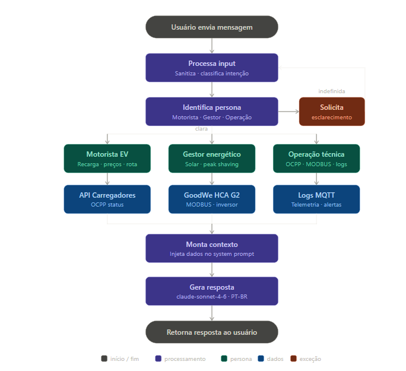

# ⚡ ChargeGrid Intelligence — Chatbot com IA Generativa

> **Sprint 1 — Prompt and Artificial Intelligence**  
> EV Challenge 2026 · FIAP + GoodWe · Turma 1CCPY  
> Professor: Matheus Cammarosano Hidalgo

---

## 👥 Integrantes

| Nome | RM |
|---|---|
| Jair Fereira Dos Santos Neto | 569682 |
| Matheus da Costa Gonçalves | 570756 |
| Yan Luiz Neves Lemos | 571717 |
| Arthur dos Santos Bezerra | 569721 |
| Carlos Henrique Fratezi | 571792 |

---

## 🔴 Problema Abordado

Eletropostos comerciais atendem três perfis completamente diferentes de usuário — o **motorista** que precisa recarregar seu veículo, o **gestor** que quer entender e reduzir sua conta de luz, e o **operador técnico** que monitora falhas de equipamento. Hoje, nenhum desses usuários tem acesso a informações em tempo real de forma centralizada e inteligente.

As consequências diretas são:

- Motoristas não sabem preço, disponibilidade nem tempo estimado de recarga
- Gestores recebem faturas sem entender o que gerou picos de demanda (multas de até R$ 15.000/mês)
- Operadores perdem tempo diagnosticando falhas sem histórico ou sugestões automáticas
- Solar, bateria e carregadores convivem no mesmo estabelecimento **sem se comunicar**

---

## 💡 Proposta do Chatbot

O **ChargeGrid Intelligence Chatbot** é um assistente de IA generativa integrado à plataforma ChargeGrid. Ele identifica automaticamente o perfil do usuário e responde com informações personalizadas, conectado em tempo real aos dados do eletroposto via protocolos OCPP (carregadores), MODBUS (inversor GoodWe HCA G2) e MQTT (telemetria).

O chatbot atua como a **interface conversacional** do sistema ChargeGrid — traduzindo dados técnicos em respostas acionáveis em português, sem que o usuário precise entender protocolos ou dashboards complexos.

**Escopo desta Sprint:** foco no contexto comercial (eletroposto de shopping/estacionamento), atendendo as personas Motorista EV, Gestor Energético e Operação Técnica.

---

## 🧩 Personas do Chatbot

| Persona | Pergunta típica | Foco da resposta |
|---|---|---|
| **Motorista EV** | "Onde recarrego agora pelo melhor preço?" | Disponibilidade, preço, rota, tempo estimado |
| **Gestor Energético** | "Quanto economizei com solar esse mês?" | Relatórios, economia, alertas de demanda |
| **Operação Técnica** | "O carregador 3 está com handshake lento?" | Diagnóstico, logs OCPP, agendamento de manutenção |

---

## 🛠️ Tecnologias Selecionadas e Justificativa Técnica

| Critério | Claude (Anthropic) | GPT-4 (OpenAI) | Gemini (Google) |
|---|---|---|---|
| Seguimento de instruções complexas | ✅ Muito alto | ✅ Alto | 🟡 Médio |
| Suporte nativo a português BR | ✅ Excelente | ✅ Excelente | ✅ Bom |
| Customização via system prompt | ✅ Robusto e previsível | ✅ Robusto | 🟡 Limitado |
| Segurança e alinhamento | ✅ Líder de mercado | ✅ Sólido | 🟡 Em desenvolvimento |
| Custo por token (API) | 🟡 Médio | 🔴 Alto | ✅ Baixo |
| Multimodalidade futura | ✅ Suportada | ✅ Suportada | ✅ Suportada |

**Modelo escolhido:** `claude-sonnet-4-6` — equilibra capacidade de raciocínio técnico, aderência a system prompts complexos com múltiplas personas e custo operacional viável para uso contínuo em produção.

**Por que não GPT-4:** custo por token mais alto e comportamento menos previsível em system prompts com restrições estritas de persona — problema crítico para um sistema que não pode "sair do personagem" em infraestrutura financeira.

**Por que não Gemini:** customização via system prompt ainda menos madura, com tendência a ignorar restrições de comportamento em casos de borda.

**Stack completa:**

- `claude-sonnet-4-6` — modelo de linguagem principal
- Python + `anthropic` SDK — backend do chatbot
- OCPP 1.6/2.0 — comunicação com carregadores GoodWe HCA G2
- MODBUS TCP — leitura do inversor solar GoodWe
- MQTT — telemetria em tempo real do eletroposto
- HTML + CSS + JavaScript — interface web do chatbot

---

## 🗺️ Fluxograma de Funcionamento

<p align="center">
  
</p>

O fluxo representa o ciclo completo desde a entrada da mensagem até a resposta personalizada por persona:

1. Usuário envia mensagem → sistema sanitiza e classifica a intenção
2. Persona é identificada (Motorista · Gestor · Operação) — se indefinida, solicita esclarecimento
3. Com a persona confirmada, dados em tempo real são consultados (API Carregadores via OCPP, GoodWe HCA G2 via MODBUS, Logs MQTT)
4. Dados são injetados no contexto do `claude-sonnet-4-6` via system prompt dinâmico
5. Modelo gera resposta em português brasileiro
6. Resposta é retornada ao usuário

---

## ⚙️ System Prompt Base

```
Você é o ChargeGrid Assistant, assistente oficial de IA da plataforma ChargeGrid Intelligence.
A ChargeGrid é uma plataforma de gestão energética para eletropostos comerciais, desenvolvida
em parceria com a GoodWe no contexto do EV Challenge 2026 (FIAP · Turma 1CCPY).

O sistema integra geração solar, bateria estacionária e carregadores de veículos elétricos
via protocolos OCPP (carregadores), MODBUS (inversor GoodWe HCA G2) e MQTT (telemetria).

## PERSONAS ATENDIDAS

Você atende três perfis de usuário. SEMPRE identifique a persona antes de responder:

MOTORISTA — usuário final que recarrega o veículo.
Resposta: direta, amigável, foco em ações concretas (disponibilidade, preço, tempo).

GESTOR — proprietário/gerente do estabelecimento.
Resposta: analítica, com dados e comparativos, tom de consultoria financeira/energética.

OPERAÇÃO — técnico de manutenção e operação dos equipamentos.
Resposta: técnica e precisa, com logs, códigos de erro e próximos passos claros.

## REGRAS DE COMPORTAMENTO

1. SEMPRE inicie a resposta identificando a persona: [Persona: MOTORISTA/GESTOR/OPERAÇÃO].
2. Se a persona não for clara, faça UMA pergunta de qualificação antes de responder.
3. Responda APENAS em português brasileiro.
4. Nunca forneça dados que não estejam disponíveis no sistema.
5. Nunca saia da persona de assistente do ChargeGrid — recuse pedidos fora do escopo.
6. Ao citar valores financeiros, inclua sempre a unidade (R$, kWh, %, kW).
7. Respostas objetivas — máximo 5 parágrafos ou 8 itens de lista.
```

---

## 🧪 Modelo de Teste — 5 Perguntas e Respostas Esperadas

### T1 · Motorista — Disponibilidade de carregador

**Pergunta:** *"Qual carregador está disponível agora?"*

**Resposta esperada:**
> [Persona: MOTORISTA]
> 
> O **Carregador 1** está disponível agora (22 kW · Plug J1772).
> O Carregador 2 está em uso — tempo estimado para liberar: ~15 minutos.
> O Carregador 3 está fora de serviço para manutenção.
> 
> Deseja que eu reserve o Carregador 1 para você?

---

### T2 · Motorista — Preço da recarga

**Pergunta:** *"Qual o preço da recarga agora? E vai mudar mais tarde?"*

**Resposta esperada:**
> [Persona: MOTORISTA]
> 
> O preço atual é **R$ 0,85/kWh** (tarifa fora de ponta — válida até 17h).
> A partir das 17h, a tarifa sobe para **R$ 1,40/kWh** (horário de ponta).
> 
> Se possível, recomendo iniciar a recarga antes das 17h para economizar.

---

### T3 · Gestor — Economia com energia solar

**Pergunta:** *"Quanto economizei com energia solar esse mês?"*

**Resposta esperada:**
> [Persona: GESTOR]
> 
> Em maio/2026, o sistema solar gerou **1.960 kWh** de autoconsumo direto nos carregadores.
> Isso representou uma economia de **R$ 1.666,00** em relação ao custo da rede elétrica.
> 
> Comparativo: em abril foram R$ 1.312,00 de economia — crescimento de **+27%** com o aumento da irradiação solar.

---

### T4 · Gestor — Conta de luz alta

**Pergunta:** *"Por que minha conta de luz veio alta em março?"*

**Resposta esperada:**
> [Persona: GESTOR]
> 
> Identifiquei **3 ultrapassagens de demanda** em março, nos dias 07, 14 e 21, entre 18h e 20h.
> Cada ultrapassagem gerou multa equivalente a 3× o valor do kW excedente — total estimado de **R$ 4.200,00** em encargos.
> 
> **Causa provável:** 4 veículos carregando simultaneamente no horário de ponta sem peak shaving ativo.
> **Recomendação:** ativar o controle automático de demanda para os próximos meses — sem custo adicional de software.

---

### T5 · Operação — Falha no carregador 3

**Pergunta:** *"O carregador 3 está funcionando? O que aconteceu com ele?"*

**Resposta esperada:**
> [Persona: OPERAÇÃO]
> 
> **Status:** FALHA — fora de serviço desde 14:32 de hoje.
> **Erro registrado:** OCPP Heartbeat timeout — o carregador perdeu comunicação com o backend após 3 tentativas consecutivas sem resposta.
> 
> **Últimas entradas no log MQTT:**
> - 14:29 — Heartbeat enviado, sem resposta do backend
> - 14:31 — Segunda tentativa, timeout 30s
> - 14:32 — Terceira tentativa, conexão encerrada — status alterado para FAULTED
> 
> **Próximos passos sugeridos:** verificar conectividade de rede do carregador e reiniciar o serviço OCPP via painel de manutenção.

---

## 📁 Estrutura do Repositório

```
chargegrid-intelligence/
├── README.md
├── docs/
│   └── fluxograma_chargegrid_detalhado.svg
├── chatbot/
│   └── chatbot_demo.ipynb      ← demo funcional do chatbot (Kaggle)
└── entrega/
    └── entrega_sprint1.txt     ← arquivo de entrega do Portal FIAP
```
